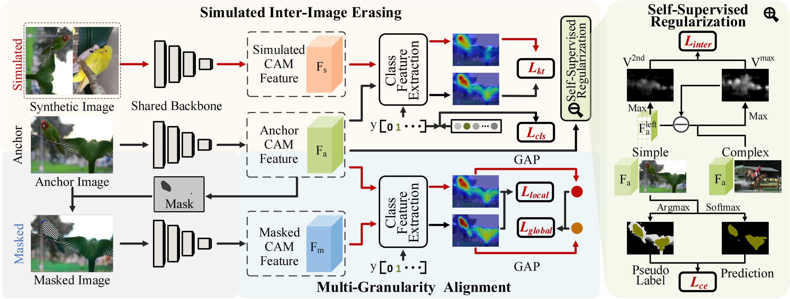

# 基于跨图像擦除模拟的弱监督语义分割知识迁移方法

This repository provides the PyTorch implementation of KTSE for weakly supervised semantic segmentation, supporting the PASCAL VOC 2012 dataset.

---

## Network Architecture



---

## Environment Setup

- Recommended: Ubuntu 18.04, Python 3.8, PyTorch 1.8.2, CUDA 11.3
- Create the environment with:
```bash
conda env create -f wsss_new.yaml
```

---

## Dataset Preparation

1. Download the [PASCAL VOC 2012 development kit](http://host.robots.ox.ac.uk/pascal/VOC/voc2012/) and place it under the `./data/` directory.

---

## Training and Testing

### 1. KTSE Stage 1 Training and Testing

- Download the ImageNet pretrained weights [ilsvrc-cls_rna-a1_cls1000_ep-0001.params](https://ktse.oss-cn-shanghai.aliyuncs.com/ilsvrc-cls_rna-a1_cls1000_ep-0001.params) and put them in the `./pretrained/` directory.
- Train KTSE:
```bash
python train.py --name ktse1 --model ktse
```
- Download the pretrained model [039net_main.pth](https://ktse.oss-cn-shanghai.aliyuncs.com/039net_main.pth) (PASCAL, seed: 67% mIoU) and put it in the `./experiments/ktse1/ckpt/` directory.
- Inference and evaluation:
```bash
python infer.py --name ktse1 --model ktse --load_epo 39 --dict  --infer_list voc12/train_aug.txt
python evaluation.py --name ktse1 --task cam --dict_dir dict
```

---

### 2. BECO Segmentation Network Training and Testing

- Install Python 3.8, PyTorch 1.11.0, and dependencies in requirements.txt.
- Download the DeeplabV2 ImageNet pretrained model [resnet101-cd907fc2.pth](https://download.pytorch.org/models/resnet101-cd907fc2.pth), rename it to `resnet-101_v2.pth`, and put it in `./data/model_zoo/`.
- Download the pseudo labels [sem_seg](https://ktse.oss-cn-shanghai.aliyuncs.com/sem_seg.zip) and extract to `./data/`.
- Download the segmentation network pretrained weights [best_ckpt_KTSE_73.0.pth](https://ktse.oss-cn-shanghai.aliyuncs.com/best_ckpt_KTSE_73.0.pth) and put them in the `./segmentation/` directory.

- Test the segmentation network (install pydensecrf if CRF post-processing is needed):
```bash
cd segmentation
pip install -r requirements.txt 
python main.py --test --logging_tag seg_result --ckpt best_ckpt_KTSE_73.0.pth
python test.py --crf --logits_dir ./data/logging/seg_result/logits_msc --mode "val"
```

---

### 3. IRN Pseudo Label Refinement

- Download [039net_main.pth](https://ktse.oss-cn-shanghai.aliyuncs.com/039net_main.pth) and put it in the `./irn/sess/` directory.
- Generate pseudo labels and confidence masks (or directly download [sem_seg](https://ktse.oss-cn-shanghai.aliyuncs.com/sem_seg.zip) and [mask_irn](https://ktse.oss-cn-shanghai.aliyuncs.com/mask_irn.zip)):
```bash
cd irn 
python run_sample.py
python gen_mask.py
```

---

### 4. Segmentation Network Training

- Example directory structure for data and pretrained models:
```
data/
    ├── VOC2012/
    ├── sem_seg/
    ├── mask_irn/
    ├── model_zoo/
    └── logging/
```
- Train the segmentation network:
```bash
cd segmentation
python main.py -dist --logging_tag seg_result --amp
```

---

## Acknowledgement

We would like to thank the authors of [KTSE](https://github.com/chentao2016/KTSE)] which has significantly accelerated the development of our


