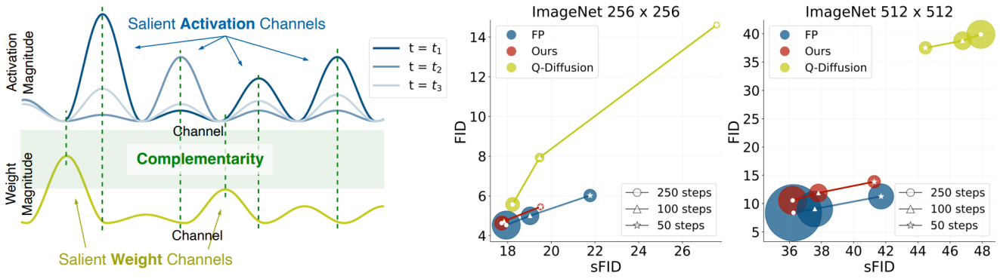

# PTQ4DiT: Post-training Quantization for Diffusion Transformers的复现指南

> 📄 论文地址：[PTQ4DiT: Post-training Quantization for Diffusion Transformers](https://arxiv.org/abs/2405.16005) （NeurIPS 2024）  
> 📷 模型结构图如下：  
> 

## 环境配置

使用以下命令创建并激活环境：

```bash
conda env create -f environment.yml
conda activate DiT
```

## 预训练模型

从 [DiT 原始仓库](https://github.com/facebookresearch/DiT?tab=readme-ov-file#sampling--) 下载以下模型权重：

- `DiT-XL-2-256x256.pt`
- `DiT-XL-2-512x512.pt`

然后将其放入目录：

```
./pretrained_models/
```

## 校准数据生成

生成 256x256 的 ImageNet 校准集示例命令如下：

```bash
mkdir calib

python get_calibration_set.py --model DiT-XL/2 --image-size 256 \
--ckpt pretrained_models/DiT-XL-2-256x256.pt \
--num-sampling-steps 50 \
--outdir calib/ --filename imagenet_DiT-256_sample4000_50steps_allst.pt \
--cfg-scale 1.5 --seed 1
```

如需其他设置，请更改 `--image-size` 和 `--num-sampling-steps` 参数。

## 量化示例

### W8A8，ImageNet 256x256，50 步长

```bash
python quant_sample.py --model DiT-XL/2 --image-size 256 \
--ckpt pretrained_models/DiT-XL-2-256x256.pt \
--num-sampling-steps 50 \
--weight_bit 8 --act_bit 8 --cali_st 25 --cali_n 64 --cali_batch_size 32 --sm_abit 8 \
--cali_data_path calib/imagenet_DiT-256_sample4000_50steps_allst.pt --outdir output/ \
--cfg-scale 1.5 --seed 1 --ptq --recon
```

### W4A8，ImageNet 512x512，50 步长

```bash
python quant_sample.py --model DiT-XL/2 --image-size 512 \
--ckpt pretrained_models/DiT-XL-2-512x512.pt \
--num-sampling-steps 50 \
--weight_bit 4 --act_bit 8 --cali_st 10 --cali_n 128 --cali_batch_size 16 --sm_abit 8 \
--cali_data_path calib/imagenet_DiT-512_sample4000_50steps_allst.pt --outdir output/ \
--cfg-scale 1.5 --seed 1 --ptq --recon
```

## 推理示例

### W8A8，ImageNet 256x256，加载量化模型继续推理

```bash
python quant_sample.py --model DiT-XL/2 --image-size 256 \
--ckpt pretrained_models/DiT-XL-2-256x256.pt \
--num-sampling-steps 50 \
--weight_bit 8 --act_bit 8 --cali_st 25 --cali_n 64 --cali_batch_size 32 --sm_abit 8 \
--cali_data_path calib/imagenet_DiT-256_sample4000_50steps_allst.pt --outdir output/ \
--cfg-scale 1.5 --seed 1 \
--resume --cali_ckpt output/256_88_50/ckpt.pth \
--ptq \
--inference --n_c 10
```

### W4A8，ImageNet 512x512，加载量化模型继续推理

```bash
python quant_sample.py --model DiT-XL/2 --image-size 512 \
--ckpt pretrained_models/DiT-XL-2-512x512.pt \
--num-sampling-steps 50 \
--weight_bit 4 --act_bit 8 --cali_st 10 --cali_n 128 --cali_batch_size 16 --sm_abit 8 \
--cali_data_path calib/imagenet_DiT-512_sample4000_50steps_allst.pt --outdir output/ \
--cfg-scale 1.5 --seed 1 \
--resume --cali_ckpt output/512_48_50/ckpt.pth \
--ptq \
--inference --n_c 5
```

## 性能评估

使用 [OpenAI 提供的 TensorFlow 评估工具](https://github.com/openai/guided-diffusion/tree/main/evaluations) 来计算 FID、sFID、IS 和 Precision。